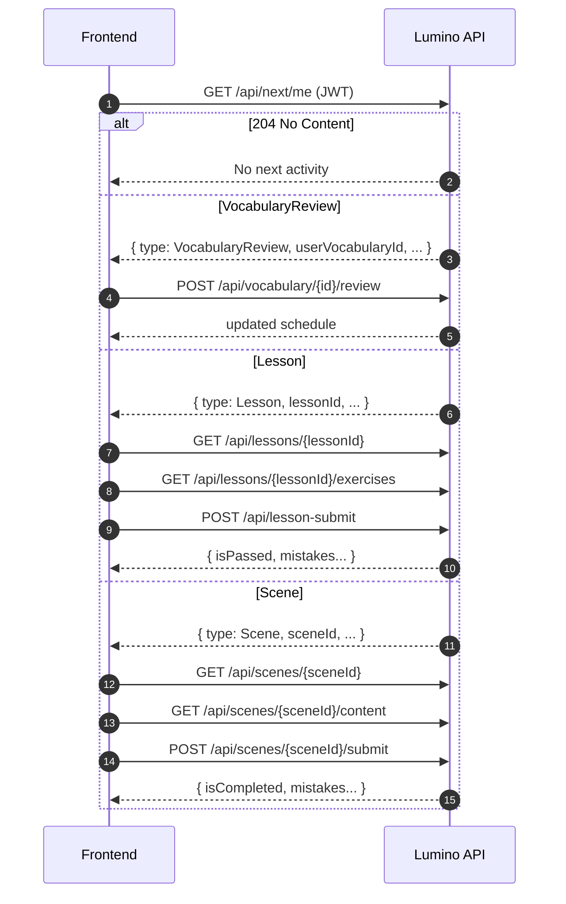
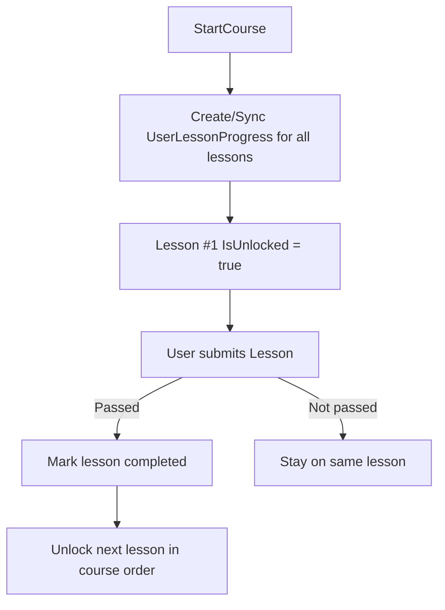

# Lumino Backend — Learning Flow

> **Ціль документа:** показати **точний порядок викликів API** для навчання (як у Duolingo) + пояснити, **коли/чому** уроки та сцени мають стани `locked / unlocked / completed`, і як отримувати **наступну активність**.

---

## 1) Базові правила (дуже важливо для фронтенду)

### 1.1 Авторизація
1) `POST /api/auth/register` або `POST /api/auth/login` → отримати `accessToken` (JWT) + `refreshToken`.
2) Для всіх навчальних ендпоінтів з `[Authorize]` передавати заголовок:

```http
Authorization: Bearer <accessToken>
```

> `userId` на бекенді береться з JWT (через `ClaimsUtils.GetUserIdOrThrow(User)`).

### 1.2 “Головний навігатор” навчання — NextActivity
Є окремий сервіс, який повертає **що робити далі**:

- `GET /api/next/me` (або alias `GET /api/learning/next`)
- Якщо немає чого робити → `204 No Content`
- Якщо є — повертає `NextActivityResponse`

**Пріоритет у NextActivity (важливо):**
1) `VocabularyReview` (якщо є слова `due`)
2) `Lesson` (перший `unlocked` і ще не `passed`)
3) `Scene` (перша доступна сцена за правилом unlock)

> Тобто якщо у користувача зʼявилися слова на повторення — NextActivity **перекриє уроки/сцени** і відправить спочатку на повторення.

---

## 2) Налаштування правил навчання (конфіг)

Ці правила лежать у `LearningSettings` (appsettings / options) і використовуються в сервісах:

- **PassingScorePercent**: `%` для зарахування уроку (за замовчуванням **80%**).
- **SceneUnlockEveryLessons**: скільки “passed уроків” потрібно на відкриття кожної наступної сцени (мінімум 1).
- **SceneCompletionScore**: використовується у сценах як поріг/логіка завершення (див. Scene submit).
- **VocabularyWrongDelayHours**: через скільки годин повторювати слово після помилки (SRS).
- **VocabularyReviewIntervalsDays**: інтервали повторення (SRS) у днях після правильних відповідей.

---

## 3) Екран “Courses” → вибір курсу

### 3.1 Отримати список курсів
- `GET /api/courses`
- Повертає **тільки опубліковані** (`IsPublished`) курси.

### 3.2 Обовʼязковий старт курсу (перед навчанням)
- `POST /api/learning/courses/{courseId}/start`

Що робить бекенд:
- створює або оновлює `UserCourse` (курс стає **active**),
- вимикає інші активні курси користувача,
- синхронізує `UserLessonProgresses` для **всіх** уроків курсу,
- робить **перший урок unlocked**,
- встановлює `LastLessonId` на коректний “де продовжити”.

> **Якщо НЕ викликати start**, то NextActivity все одно спробує підібрати курс, але фронтенду краще працювати з явним “активним курсом”.

### 3.3 Отримати активний курс користувача
- `GET /api/learning/courses/active`
- Якщо активного курсу нема → `404 Not Found`

---

## 4) Екран “Learning Path / Доріжка” (Topics + Lessons + стани)

### 4.1 Отримати Topics у курсі (публічний)
- `GET /api/courses/{courseId}/topics`

### 4.2 Отримати lessons у topic (публічний)
- `GET /api/topics/{topicId}/lessons`

### 4.3 Найзручніший варіант для доріжки: “мій шлях” по курсу
- `GET /api/learning/courses/{courseId}/path/me`

Повертає:
- Course → Topics → Lessons
- для кожного уроку:
  - `IsUnlocked`
  - `IsPassed`
  - `BestScore`
  - `TotalQuestions`
  - `BestPercent`

> Це найкращий ендпоінт для рендеру “карти” навчання: фронтенд не мусить вручну склеювати topics/lessons/progress.

### 4.4 Детальний прогрес уроків у курсі (якщо треба)
- `GET /api/learning/courses/{courseId}/lessons/progress`

---

## 5) Уроки: повний “happy path” (виконання уроку)

### 5.1 Отримати урок (деталі + теорія + доступ)
- `GET /api/lessons/{lessonId}` *(Authorize)*

> Якщо урок locked, бекенд поверне **403 Forbidden** при submit, а при отриманні уроку/вправ — фронтенд орієнтується на `IsUnlocked` у Learning Path.

### 5.2 Отримати вправи уроку
- `GET /api/lessons/{lessonId}/exercises` *(Authorize)*

### 5.3 Відправити відповіді (submit)
- `POST /api/lesson-submit` *(Authorize)*

Body:
```json
{
  "lessonId": 123,
  "answers": [
    { "exerciseId": 1, "answer": "..." },
    { "exerciseId": 2, "answer": "..." }
  ]
}
```

Response (`SubmitLessonResponse`) важливе:
- `IsPassed` — чи урок зараховано
- `CorrectAnswers`, `TotalExercises`
- `MistakeExerciseIds` + деталізація `Answers`

### 5.4 Що відбувається на бекенді після submit уроку
1) Рахується `IsPassed` за правилом:

- якщо `TotalQuestions <= 0` → `false`
- інакше: `correct * 100 >= total * PassingScorePercent`

2) Записується `LessonResult` (історія спроб).
3) Оновлюється `UserProgress` (Score / CompletedLessons / Streak логіка).
4) Якщо `IsPassed == true`:
   - оновлюється `UserLessonProgress` (`IsCompleted = true`, `BestScore`…),
   - **unlock наступного уроку** (по порядку в курсі),
   - `UserCourse.LastLessonId` переноситься на наступний урок,
   - може бути виставлено `UserCourse.IsCompleted` якщо всі уроки завершені,
   - запускається перевірка досягнень.

5) Автоматичне Vocabulary після **Passed**:
   - слова беруться з Lesson theory + з помилок
   - якщо слово було помилкою → `NextReviewAt = now` (тобто слово **due одразу**)
   - інакше → `NextReviewAt = now + 1 day`

---

## 6) Vocabulary (SRS): повторення та “слова на сьогодні”

### 6.1 Весь словник користувача
- `GET /api/vocabulary/me`

### 6.2 Слова, які “due” (час повторення настав)
- `GET /api/vocabulary/due`

### 6.3 “Наступне слово на повторення”
- `GET /api/vocabulary/review/next`
- Якщо немає слів → `204 No Content`

### 6.4 Додати слово вручну
- `POST /api/vocabulary`

Body:
```json
{
  "word": "cat",
  "translation": "кіт",
  "example": "The cat is sleeping."
}
```

### 6.5 Відповісти на повторення (правильно/неправильно)
- `POST /api/vocabulary/{id}/review`

Body:
```json
{ "isCorrect": true }
```

Результат:
- оновлюється `ReviewCount`, `LastReviewedAt`, `NextReviewAt`
- інтервали повторення беруться з `VocabularyReviewIntervalsDays`
- при помилці використовується `VocabularyWrongDelayHours`

### 6.6 Видалити слово
- `DELETE /api/vocabulary/{id}`

---

## 7) Scenes (історії): unlock → контент → submit → mistakes

### 7.1 Список сцен (публічний)
- `GET /api/scenes`

### 7.2 Деталі сцени для користувача (locked/completed + причина)
- `GET /api/scenes/{sceneId}` *(Authorize)*

Повертає:
- `IsUnlocked`
- `RequiredPassedLessons`
- `UnlockReason` (якщо locked)
- `IsCompleted`

### 7.3 Отримати контент сцени (кроки), тільки якщо unlocked
- `GET /api/scenes/{sceneId}/content` *(Authorize)*

> Якщо сцена locked → буде **403 Forbidden**.

### 7.4 Submit сцени
- `POST /api/scenes/{sceneId}/submit` *(Authorize)*

Body:
```json
{
  "answers": [
    { "stepId": 10, "answer": "A" },
    { "stepId": 11, "answer": "B" }
  ]
}
```

Response (`SubmitSceneResponse`) містить:
- `TotalQuestions`
- `CorrectAnswers`
- `IsCompleted`
- `MistakeStepIds` + деталізація відповідей

### 7.5 “Repeat mistakes” (як у Duolingo)
1) Отримати кроки, де були помилки в останній спробі:
   - `GET /api/scenes/{sceneId}/mistakes`
2) Відправити повторно тільки ці кроки:
   - `POST /api/scenes/{sceneId}/mistakes/submit`

### 7.6 Ручне завершення сцени (якщо потрібно)
- `POST /api/scenes/complete` *(Authorize)*

Body:
```json
{ "sceneId": 55 }
```

### 7.7 Отримати всі completed сцени користувача
- `GET /api/scenes/completed` *(Authorize)*

---

## 8) Прогрес, результати та досягнення (профіль)

### 8.1 Загальний прогрес користувача
- `GET /api/progress/me` *(Authorize)*

Повертає:
- `TotalScore`
- `CompletedLessons`
- `CompletionPercent`
- `CurrentStreakDays` + `LastStudyAt`
- `TotalScenes` / `CompletedDistinctScenes` і т.д.

### 8.2 Історія результатів (уроки)
- `GET /api/results/me` *(Authorize)*
- Деталі конкретної спроби:
  - `GET /api/results/me/{resultId}` *(Authorize)*

### 8.3 Досягнення користувача
- `GET /api/achievements/me` *(Authorize)*

---

## 9) Рекомендований сценарій фронтенду (коротко, але повністю)

Найпростіший і стабільний флоу:

1) Login/Register → зберегти токени
2) `GET /api/learning/courses/active`
   - якщо `404` → показати Courses і викликати `POST /api/learning/courses/{courseId}/start`
3) `GET /api/learning/courses/{courseId}/path/me` → намалювати доріжку
4) Кнопка “Continue” / авто-перехід:
   - `GET /api/next/me`
   - якщо `VocabularyReview` → показати екран повторення і працювати через `/api/vocabulary/...`
   - якщо `Lesson` → `GET /api/lessons/{id}` + `GET /api/lessons/{id}/exercises` → `POST /api/lesson-submit`
   - якщо `Scene` → `GET /api/scenes/{id}` → `GET /api/scenes/{id}/content` → `POST /api/scenes/{id}/submit`
5) Після будь-якого завершення (урок/сцена/слово):
   - оновити UI: `GET /api/progress/me`
   - оновити доріжку: `GET /api/learning/courses/{courseId}/path/me`
   - отримати “що далі”: `GET /api/next/me`

---

## 10) Типові помилки інтеграції (і як правильно)

### 10.1 403 Forbidden на submit уроку
Причина: урок `locked`.

Правильно:
- спочатку `POST /api/learning/courses/{courseId}/start`
- працювати тільки з уроками, де `IsUnlocked == true` (з path/me)

### 10.2 NextActivity повертає VocabularyReview, хоча ви “хотіли урок”
Це **очікувана логіка**: у NextActivity пріоритет у due-слова.

Якщо треба “примусово” відкрити урок:
- відкривайте з доріжки (`path/me`) і викликайте урок напряму
- або “закрийте” due-слова через `/api/vocabulary/{id}/review`

### 10.3 Scenes: locked, але список сцен показує всі
`GET /api/scenes` — публічний список.
Статус locked/unlocked — це **персонально**, тому потрібно викликати:
- `GET /api/scenes/{id}` (Authorize)

---

## 11) Mermaid-схеми (для швидкої візуалізації)

### 11.1 Continue flow (NextActivity)


### 11.2 Unlock rules (уроки)


---

## 12) Швидкий довідник ендпоінтів (тільки те, що потрібно для навчання)

| Feature | Method | Endpoint |
|---|---:|---|
| Register | POST | `/api/auth/register` |
| Login | POST | `/api/auth/login` |
| Refresh token | POST | `/api/auth/refresh` |
| Logout | POST | `/api/auth/logout` |
| Courses | GET | `/api/courses` |
| Start course | POST | `/api/learning/courses/{courseId}/start` |
| Active course | GET | `/api/learning/courses/active` |
| Course path (me) | GET | `/api/learning/courses/{courseId}/path/me` |
| Topics in course | GET | `/api/courses/{courseId}/topics` |
| Lessons in topic | GET | `/api/topics/{topicId}/lessons` |
| Lesson details | GET | `/api/lessons/{lessonId}` |
| Lesson exercises | GET | `/api/lessons/{lessonId}/exercises` |
| Submit lesson | POST | `/api/lesson-submit` |
| Next activity | GET | `/api/next/me` |
| My progress | GET | `/api/progress/me` |
| Results | GET | `/api/results/me` |
| Result details | GET | `/api/results/me/{resultId}` |
| Achievements | GET | `/api/achievements/me` |
| Vocabulary list | GET | `/api/vocabulary/me` |
| Vocabulary due | GET | `/api/vocabulary/due` |
| Next vocab review | GET | `/api/vocabulary/review/next` |
| Add vocab | POST | `/api/vocabulary` |
| Review vocab | POST | `/api/vocabulary/{id}/review` |
| Delete vocab | DELETE | `/api/vocabulary/{id}` |
| Scenes list | GET | `/api/scenes` |
| Scene details | GET | `/api/scenes/{id}` |
| Scene content | GET | `/api/scenes/{id}/content` |
| Scene submit | POST | `/api/scenes/{id}/submit` |
| Scene mistakes | GET | `/api/scenes/{id}/mistakes` |
| Submit mistakes | POST | `/api/scenes/{id}/mistakes/submit` |
| Mark scene completed | POST | `/api/scenes/complete` |
| Completed scenes | GET | `/api/scenes/completed` |

---

### Примітка
Цей документ описує **саме поточний** стан вашого `backend.zip` (Lumino.API) і відповідає фактичним контролерам/роутам та правилам у сервісах.
